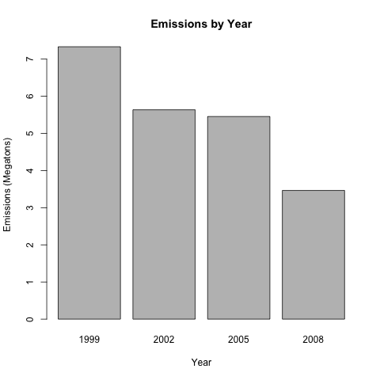
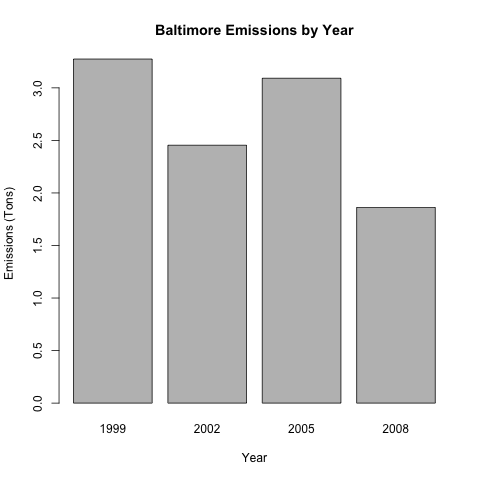
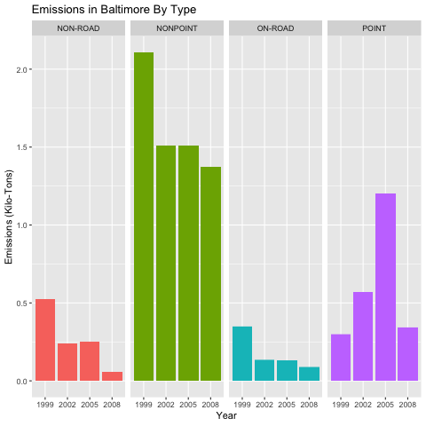
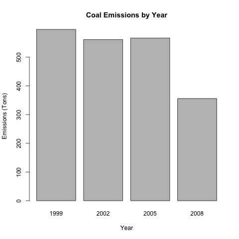
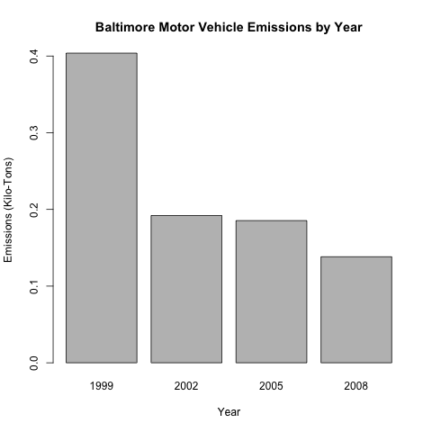
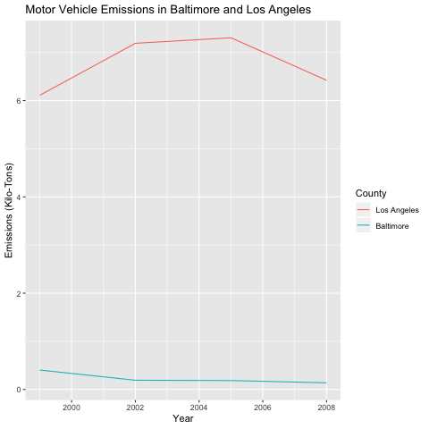

# Instructions

Fine particulate matter (PM2.5) is an ambient air pollutant for which there is strong evidence that it is harmful to human health. In the United States, the Environmental Protection Agency (EPA) is tasked with setting national ambient air quality standards for fine PM and for tracking the emissions of this pollutant into the atmosphere. Approximatly every 3 years, the EPA releases its database on emissions of PM2.5. This database is known as the National Emissions Inventory (NEI). You can read more information about the NEI at the EPA National Emissions Inventory web site.

For each year and for each type of PM source, the NEI records how many tons of PM2.5 were emitted from that source over the course of the entire year. The data that you will use for this assignment are for 1999, 2002, 2005, and 2008.

# Data
The data for this assignment are available from the course web site as a single zip file:

Data for Peer Assessment [29Mb]
The zip file contains two files:

PM2.5 Emissions Data **summarySCC_PM25.rds**: This file contains a data frame with all of the PM2.5 emissions data for 1999, 2002, 2005, and 2008. For each year, the table contains number of tons of PM2.5 emitted from a specific type of source for the entire year. Here are the first few rows.

- fips: A five-digit number (represented as a string) indicating the U.S. county
- SCC: The name of the source as indicated by a digit string (see source code classification table)
- Pollutant: A string indicating the pollutant
- Emissions: Amount of PM2.5 emitted, in tons
- type: The type of source (point, non-point, on-road, or non-road)
- year: The year of emissions recorded

Source Classification Code Table **Source_Classification_Code.rds**: This table provides a mapping from the SCC digit strings in the Emissions table to the actual name of the PM2.5 source. The sources are categorized in a few different ways from more general to more specific and you may choose to explore whatever categories you think are most useful. For example, source "10100101"" is known as "Ext Comb /Electric Gen /Anthracite Coal /Pulverized Coal".

# Questions
You must address the following questions and tasks in your exploratory analysis. For each question/task you will need to make a single plot. Unless specified, you can use any plotting system in R to make your plot.

## Question 1 
Have total emissions from PM2.5 decreased in the United States from 1999 to 2008? Using the base plotting system, make a plot showing the total PM2.5 emission from all sources for each of the years 1999, 2002, 2005, and 2008.

## Answer 1 
Yes, the total emissions have decreased.

```{r agg, echo = TRUE}
# sum the emissions from NEI, by year
agg <-  aggregate(Emissions ~ year, NEI, sum)

# show emissions in mega-tons
agg$Emissions <- agg$Emissions / 10^6

# plot
barplot(height = agg$Emissions, horiz = FALSE, names.arg=agg$year, width = 1, main = "Emissions by Year",
        xlab = "Year", ylab = "Emissions (Megatons)")

```



## Question 2
Have total emissions from PM2.5 decreased in the Baltimore City, Maryland (fips == "24510"| fips=="24510") from 1999 to 2008? Use the base plotting system to make a plot answering this question.
 
## Answer 2 
Yes, the overall emissions have decreased in Baltimore.

```{r agg, echo = TRUE}
# baltimore data
baltimore <- subset(NEI, fips=="24510")

# sum the emissions from NEI, by year
agg <-  aggregate(Emissions ~ year, baltimore, sum)

# show emissions in tons
agg$Emissions <- agg$Emissions / 10^3

# plot
barplot(height = agg$Emissions, horiz = FALSE, names.arg=agg$year, width = 1, main = "Baltimore Emissions by Year",
        xlab = "Year", ylab = "Emissions (Tons)")

```



## Question 3
Of the four types of sources indicated by the (point, nonpoint, onroad, nonroad) variable, which of these four sources have seen decreases in emissions from 1999–2008 for Baltimore City? Which have seen increases in emissions from 1999–2008? Use the ggplot2 plotting system to make a plot answer this question.
 
## Answer 3
Decreases: Non-Road, Non-point, On-road

Increases: Point

```{r agg, echo = TRUE}
# baltimore data
baltimore <- subset(NEI, fips=="24510")
baltimore$Emissions <- baltimore$Emissions / 10^3

# plot
plot3 <- ggplot(data = baltimore, aes(x = factor(year), y = Emissions, fill = type)) +
    facet_grid(.~type) + 
    geom_bar(stat = "identity") +
    guides(fill = FALSE) +
    labs(x = "Year", y = "Emissions (Tons)", title = "Emissions in Baltimore By Type") 

```



## Question 4
Across the United States, how have emissions from coal combustion-related sources changed from 1999–2008?

## Answer 4 
Yes, the pm 25 coal emissions have decreased from from 1999 to 2008

```{r agg, echo = TRUE}
# data
merged <- merge(NEI, SCC, by = "SCC")
merged <- data.table(merged)
coal <- merged[Short.Name %like% "Coal"]

# display data in tons
coal$Emissions <- coal$Emissions / 10^3

# sum the emissions from coal, by year
agg <-  aggregate(Emissions ~ year, coal, sum)

# plot
barplot(height = agg$Emissions, horiz = FALSE, names.arg=agg$year, width = 1, main = "Coal Emissions by Year",
        xlab = "Year", ylab = "Emissions (Tons)")

```



## Question 5
How have emissions from motor vehicle sources changed from 1999–2008 in Baltimore City?

## Answer 5
The Vehicle Emissions in Baltimore have dropped between 1999 and 2008.

```{r agg, echo = TRUE}
merged <- merge(NEI, SCC, by = "SCC")
baltimore <- subset(merged, fips=="24510")
baltimore <- data.table(baltimore)
vehicle <- baltimore[SCC.Level.Two %like% "Vehicle"]

# display data in tons
vehicle$Emissions <- vehicle$Emissions / 10^3

# sum the emissions from coal, by year
agg <-  aggregate(Emissions ~ year, vehicle, sum)

# plot
barplot(height = agg$Emissions, horiz = FALSE, names.arg=agg$year, width = 1, main = "Baltimore Motor Vehicle Emissions by Year",
        xlab = "Year", ylab = "Emissions (Tons)")

```




## Question 6 
Compare emissions from motor vehicle sources in Baltimore City with emissions from motor vehicle sources in Los Angeles County, California (fips == "06037"). Which city has seen greater changes over time in motor vehicle emissions?

## Answer 6
Los Angeles has experienced greater changes than Baltimore over time.

```{r agg, echo = TRUE}
merged <- merge(NEI, SCC, by = "SCC")
cities <- subset(merged, fips == "24510" | fips == "06037")
cities <- data.table(cities)

vehicle <- cities[SCC.Level.Two %like% "Vehicle"]

# display data in kilo-tons
vehicle$Emissions <- vehicle$Emissions / 10^3

# plot
gp <- ggplot(vehicle, aes(year, Emissions, color = fips)) + geom_line(stat = "summary",fun.y = "sum") + 
    labs(x = "Year", y = "Emissions (Kilo-Tons)", title = "Motor Vehicle Emissions in Baltimore and Los Angeles") +
    scale_colour_discrete(name = "County", label = c("Los Angeles","Baltimore"))
print(gp)

```

